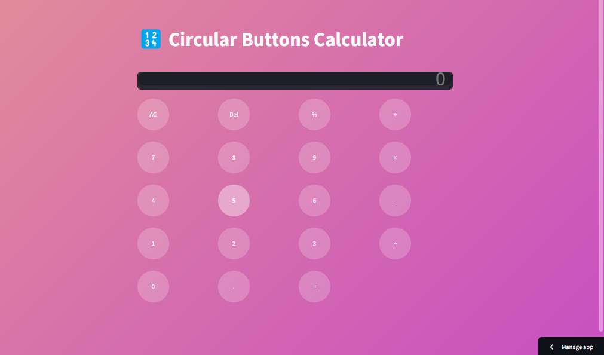

# 🧮 Interactive Streamlit Calculator Application

Welcome to the **Streamlit Calculator** repository! This project features a clean, responsive, and dynamic web-based calculator built entirely using Python and the Streamlit framework.

The application is designed to handle standard arithmetic computations through an intuitive user interface, serving as an excellent demonstration of deploying Python scripts into interactive web apps.

---

## 🖥️ Application User Interface Preview

Below is the live execution environment and UI interface of the calculator application from my local development workspace:

<!-- Streamlit UI Screenshot Section -->

  
  
<i>Streamlit Web Interface — Dynamic Calculator Dashboard</i>

---

## 🛠️ Features & Core Functionality

- **Arithmetic Execution Engine:** Supports addition, subtraction, multiplication, division, and modulo operations.
- **Responsive Control Inputs:** Utilizes Streamlit's slider, numerical inputs, or custom button arrays for seamless data ingestion.
- **Error & Exception Handling:** Built-in validation to prevent system crashes (e.g., handling explicit Division by Zero exceptions).
- **Real-time Compiling:** Renders output arrays instantly upon value adjustments without manual page refreshes.

---

## 💻 Tech Stack & Dependencies

- **Language:** Python 3.10+
- **Core Web Framework:** Streamlit
- **Math Operations:** Standard Python Math Library

---

## 🚀 How to Run the Project Locally

Follow these precise steps to spin up the web dashboard on your local PC machine:
